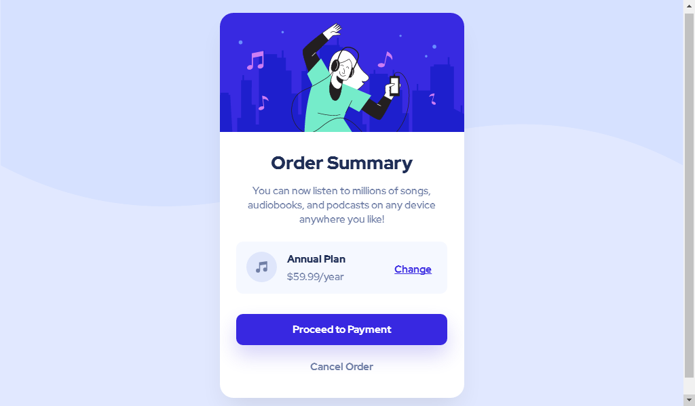

# Frontend Mentor - Order summary card solution

[👨‍💻 View live site](https://dimaskuy.github.io/order-summary.github.io/)

This is a solution to the [Order summary card challenge on Frontend Mentor](https://www.frontendmentor.io/challenges/order-summary-component-QlPmajDUj). Frontend Mentor challenges help you improve your coding skills by building realistic projects.

## Table of contents

- [Overview](#overview)
  - [The challenge](#the-challenge)
  - [Screenshot](#screenshot)
  - [Links](#links)
- [My process](#my-process)
  - [Built with](#built-with)
  - [What I learned](#what-i-learned)
  - [Continued development](#continued-development)
- [Author](#author)
- [Acknowledgments](#acknowledgments)

## Overview

### The challenge

Users should be able to:

- See hover states for interactive elements

### Screenshot

### Links

- Solution URL: [Solution URL](https://www.frontendmentor.io/challenges/order-summary-component-QlPmajDUj/hub/order-summary-card-bootstrap-flexbox-JjnPYjZ-l)
- Live Site URL: [Live site](https://dimaskuy.github.io/order-summary.github.io/)

## My process

### Built with

- HTML5
- CSS
- CSS Custom Variable
- CSS Flexbox
- Bootstrap Framework ([Bootstrap Framework site](https://getbootstrap.com))
- Animate on Scroll Library ([AOS Library site](https://michalsnik.github.io/aos/))

### What I learned

In this project, I've learned by experimenting with more complex Flexbox CSS. And this is the third time I've applied design to code.

### Continued development

I hope that in the future, I will always experience developments in making websites or applying designs to websites.

## Author

- Website - [@dimaskuy's GitHub](http://github.com/dimaskuy)
- Frontend Mentor - [@dimaskuy](https://www.frontendmentor.io/profile/dimaskuy)
- Twitter - [@_dimaskuy](https://www.twitter.com/_dimaskuy)

## Acknowledgments

Thank you to all Frontend Mentors who have given challenges to junior developers like me.
